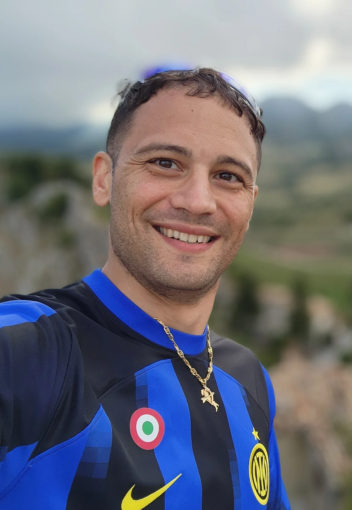

<section>
  <figure>
    <picture>
      <source
        type="image/webp"
        srcset="./../public/profile-photo/profile-photo-750.webp 750w, ./../public/profile-photo/profile-photo-1200.webp 1200w, ./../public/profile-photo/profile-photo-1500.webp"
        sizes="(max-width: 768px) 95vw, (max-width: 1200px) 50vw, 33vw"
      />
      
    </picture>
    <figcaption class="md-typescale-title-medium profile-figcaption">Me in Abruzzo, Italy in 2025</figcaption>
  </figure>
</section>